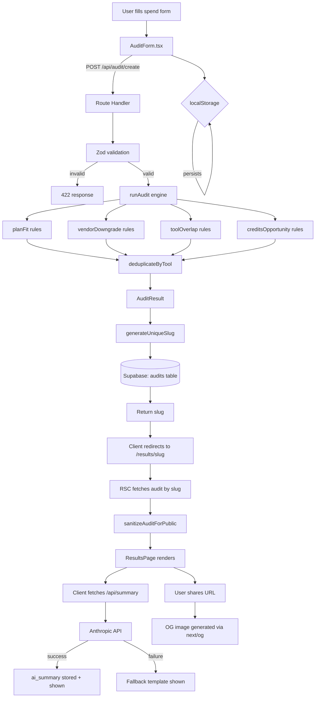

# StackTally Architecture & Data Flow

StackTally is an AI stack spend auditing tool designed to run in under 60 seconds. It is built using the Next.js App Router, React Server Components (RSC), Supabase PostgreSQL, and Upstash Redis.

## Architectural Principles

1. **Pure Auditing Engine**: The spend calculations and rule engine are written as pure, side-effect-free TypeScript functions. They run synchronously, are fully deterministic, and are 100% testable in isolation.
2. **Server-Client Boundaries & Privacy**: Public share pages (`/results/[slug]`) retrieve database records via secure React Server Components, sanitize all Personally Identifiable Information (PII) like emails, company names, and exact spent amounts, and render a standardized breakdown. Private tables (leads, funnel events) are completely hidden under Row Level Security (RLS) policies.
3. **Resilient Rate Limiting**: Request validation routes are protected by a sliding-window rate limiter powered by Upstash Redis to prevent burst attacks at window boundaries.
4. **Dynamic Metadata & OG Sharing**: Shared links dynamically render highly customized social cards (Twitter, Slack, LinkedIn) using Next.js Edge runtime and Satori (`ImageResponse`), allowing users to easily screenshot and share their savings.

---

## Data Flow Diagram

The following Mermaid diagram outlines the end-to-end data flow from form submission to shareable URL rendering:

---

## Component breakdown

### 1. The Audit Engine (`/engine`)
- **Pricing Configuration (`pricing.ts`)**: Defines official pricing schemes, license minimums, and use case profiles in integer cents.
- **Rule Modules (`/rules`)**:
  - `planFit`: Detects if team sizes align with plan constraints.
  - `toolOverlap`: Pins redundancies (e.g., Cursor + Copilot) and flags potential savings.
  - `vendorDowngrade`: Flags cheaper plan alternatives from the same vendor.
  - `creditsOpportunity`: Pinpoints opportunities for Credex discount credits.
- **De-duplicator (`index.ts`)**: Merges multiple matching recommendations per tool, prioritizing higher savings.

### 2. The Storage Layer (`/db`, `/lib`)
- **audits table**: Stores the unique alphanumeric `slug`, raw inputs, raw calculated output results, and monthly savings. Protected by a public SELECT read-only RLS policy.
- **leads table**: Captures corporate leads, email contacts, and prioritization details. Access is strictly disabled for anonymous clients; only accessible via Supabase `service_role` authority.
- **events table**: Tracks funnel steps (from form starts to link sharing) for marketing analytics.

### 3. Sharing & Social (`/app/results/[slug]`)
- **Metadata Generator**: Pulls public savings dynamically at request time to generate accurate dynamic metadata title and description strings.
- **Edge OG Engine**: The Edge runtime compiles custom layout structures into an image response immediately at the edge. Satori is utilized to compile plain CSS-in-JS nodes, removing external asset loading bottlenecks.
