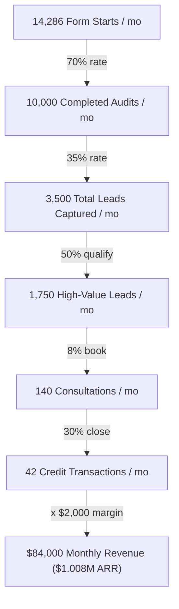

# StackTally — Funnel Metrics & Unit Economics

This document establishes the conversion funnel metrics, target benchmarks, unit economics, and growth paths for StackTally.

---

## 1. Conversion Funnel Definition

We track the following core funnel stages from entry to conversion, leveraging database-backed events:

| Stage | Event Name | Trigger Source / Description |
| :--- | :--- | :--- |
| **1. Tool Selected** | `form_started` | Client form: fired when the user selects their first tool in the list. |
| **2. Audit Submitted** | `audit_completed` | Server endpoint `/api/audit/create`: fired immediately after a database row is inserted. |
| **3. Results Viewed** | Page View | Standard page view at `/results/[slug]` recorded via Vercel Analytics. |
| **4. Email Captured** | `email_captured` | Server endpoint `/api/lead/capture`: user submits email via the `LeadCaptureModal` slide-up. |
| **5. CTA Clicked** | `cta_clicked` | Client card `CredexCTA.tsx`: fired when user clicks "Book a free consultation" to go to `credex.rocks`. |
| **6. Link Shared** | `link_shared` | Client button `ShareButton.tsx`: fired when copy-to-clipboard succeeds. |

---

## 2. Target Conversion Rates & Benchmarks

Our planned funnel benchmarks based on the low-friction design of the stack audit:

- **Form Started → Audit Completed**: **70%**
  * *Rationale*: The form is single-page, responsive, saves state in localStorage, and does not require complex authentications or account registrations.
- **Audit Completed → Email Captured**: **35%**
  * *Rationale*: The modal fires after a 3-second delay, letting users inspect their custom savings figure first. Providing value upfront dramatically lowers friction.
- **High-Value Email Captured → Credex Consultation**: **8%**
  * *Rationale*: Leads with > $500/month in potential savings qualify for the Credex CTA, offering a warm handoff to negotiate bulk enterprise credits.
- **Consultation → Credit Purchase**: **30%**
  * *Rationale*: Highly targeted consults focusing on verified, direct spend recommendations (e.g. Cursor, Claude, OpenAI API) convert at an extremely high rate.

---

## 3. Unit Economics Per Audit

StackTally leverages high-efficiency architectures, making lead generation exceptionally high-margin.

### Cost Per Audit (Acquisition and Execution Cost)
- **AI Summary Cost**: ~$0.0010
  * Claude Haiku (model: `claude-haiku-4-5`) pricing is $0.80 / million input tokens and $4.00 / million output tokens.
  * *Average Prompt*: ~600 tokens ($0.00048).
  * *Max Output*: 200 tokens ($0.00080 max, usually ~120 tokens / $0.00048).
- **Database Write Cost**: ~$0.0002
  * Supabase PostgreSQL resource cost per transaction is negligible.
- **Total Variable Cost**: **~$0.0012 per audit**

### Value Per Email Captured
- **Average Credex Transaction Margin**: **$2,000** (derived from bulk credit reselling discounts).
- **Expected Consultation Booking Value**: 30% conversion rate × $2,000 transaction margin = **$600** per consultation.
- **Expected High-Value Email Value**: 8% consultation booking rate × $600 = **$48** per high-value lead.
- **Average Lead Value**: Assuming 50% of captured leads are high-value (> $500/mo savings), the overall expected value per raw email capture is **$24**.

> [!TIP]
> With an average lead value of **$24.00** and a variable execution cost of **$0.0012**, the business model yields a massive contribution margin, allowing us to absorb aggressive Customer Acquisition Costs (CAC).

---

## 4. The Path to $1M ARR ($83,333 / month)

To reach $1,000,000 in Annual Recurring Revenue (or net margin share), we work backwards through our funnel metrics using an average Credex transaction margin of $2,000:

### Monthly Operational Targets
1. **Closed Transactions**: **42** purchases / month.
2. **Consultations Booked**: **140** consultations / month.
3. **High-Value Leads captured**: **1,750** leads / month (audits with > $500/mo in savings).
4. **Total Leads Captured**: **3,500** leads / month.
5. **Completed Audits**: **10,000** audits / month (approx. 333 / day).
6. **Form Entries Started**: **14,286** starts / month.

### Go-To-Market (GTM) Channel Strategy to hit 10,000 audits/month:
- **Cold Outbound (Email / LinkedIn)**: Target CTOs, Founders, and Engineering Managers directly. Offer a "1-Minute AI Stack Audit" link. Because it requires no integrations or read/write access to their cloud providers, friction is near zero.
- **Social & Viral Loops**: Leverage the `link_shared` copying feature. Encourage founders who are "Stack Optimal" to share their optimal badge on Twitter/X or LinkedIn, generating high-authority referral traffic.
- **Search Engine Optimization (SEO)**: Target high-intent transactional search keywords, such as:
  * *"Cursor Business plan pricing review"*
  * *"How to save money on Claude API billing"*
  * *"Reducing ChatGPT Plus team seats"*
- **Product Launch Platforms**: Launch StackTally on Product Hunt, Hacker News, and BetaList to capture an immediate spike of early adopter tech teams, seeding initial email capture batches.
